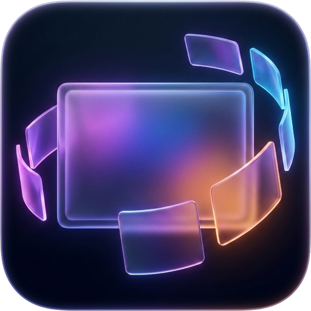
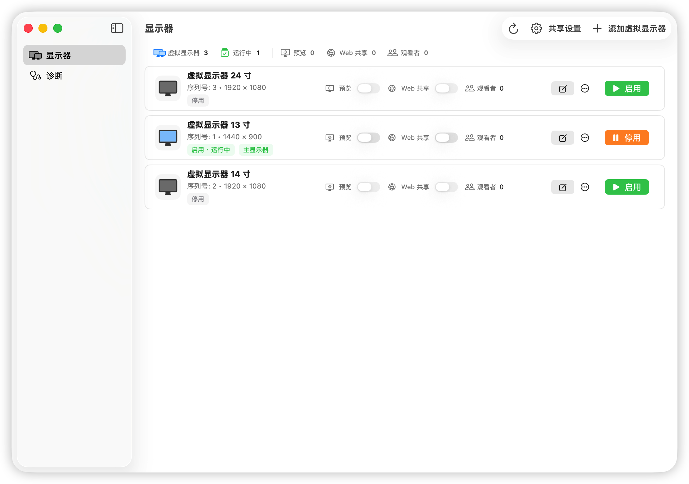
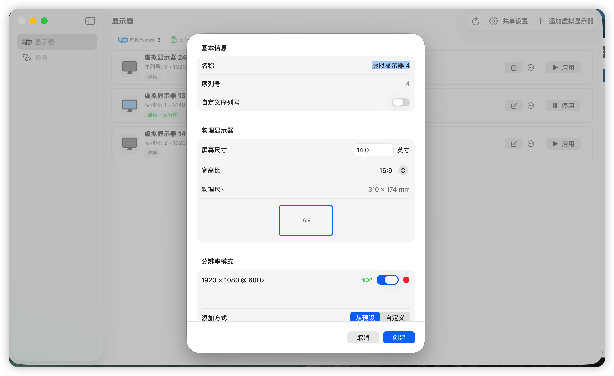
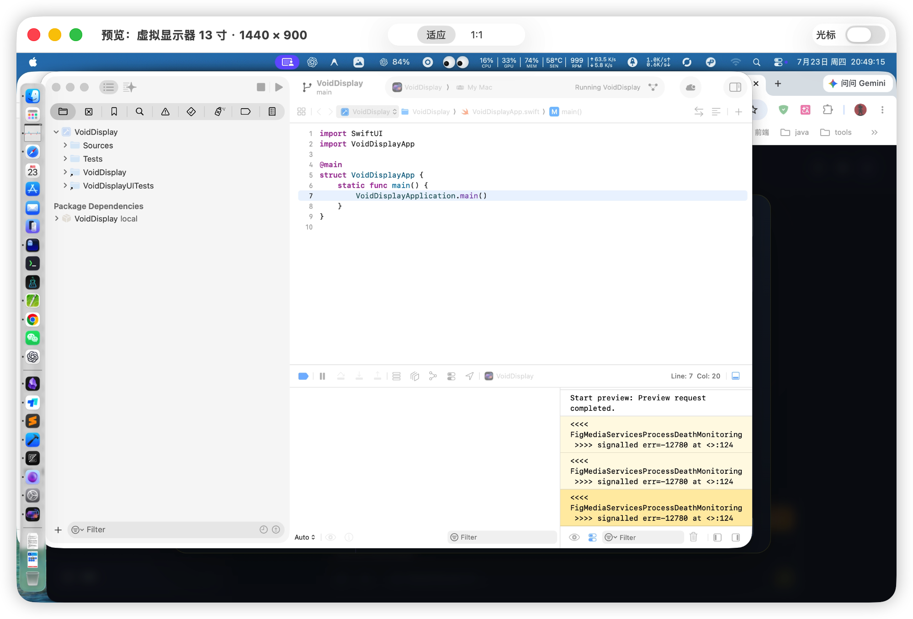
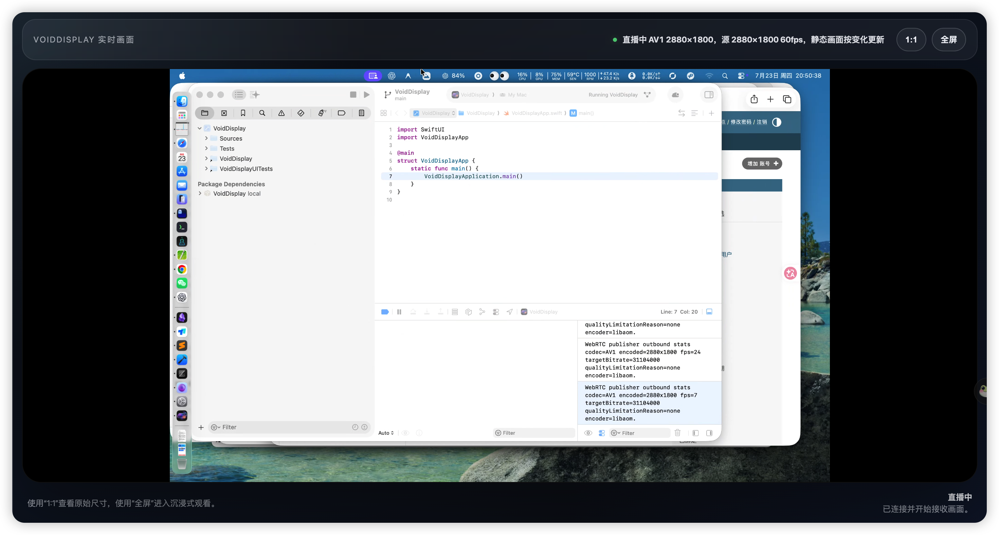

<div align="center">
  
  <h1>VoidDisplay</h1>
  <p>Create virtual displays, preview them, and share them over LAN from your Mac.</p>
  <a href="./README.zh-CN.md">简体中文</a>
</div>

## ✨ Features

### 🖥️ Virtual Displays

Create virtual monitors with custom resolution and refresh rate.
Perfect for headless Mac setups, display testing, or extending your workspace without a physical monitor.

The main window keeps each display's resolution, running state, preview controls, and LAN sharing controls in one list.



Choose **Present and Share** (1920 × 1080 at 60 Hz) or **Clear Text** (1920 × 1080 workspace with 3840 × 2160 HiDPI pixels). Advanced Settings exposes physical size, serial number and custom modes. **Create and Preview** opens the new display; a preview failure keeps the saved display available for retry.



### 👀 Preview

Preview an enabled virtual display in its own dedicated floating window.
Use it to inspect a managed display without switching macOS spaces.

The preview window supports Fit, 1:1, and cursor visibility controls.



### 📡 LAN Screen Sharing

Share an enabled virtual display over your local network through the built-in low-latency live page.
Open the generated capability-protected `/display` URL in a modern browser on a trusted LAN. Playback uses WebRTC media streaming with WebSocket signaling.

The browser page reports playback state and provides Fit, 1:1, fullscreen, expandable stream details and manual retry for recoverable connection failures. Host counts represent signaling connections, including separate tabs on one device. Confirm actual playback on the receiver.



## 💻 System Requirements

- macOS 15.6 or later
- Intel or Apple Silicon Mac

## 📥 Installation

### Download

Check the [Releases](https://github.com/iamsyc/VoidDisplay/releases) page for the latest build.

### Ad Hoc Signed Build Notice

Current release builds are ad hoc signed only. They are not Developer ID signed, notarized, or certified by Apple, so macOS may block first launch with messages like:

- "cannot be opened because Apple cannot check it for malicious software"
- "is damaged and can't be opened"

If this happens:

1. In Finder, right-click `VoidDisplay.app`, then choose **Open**.
2. If still blocked, run:

```bash
xattr -dr com.apple.quarantine "/Applications/VoidDisplay.app"
```

### Build from Source

1. Clone this repository.
2. Open `VoidDisplay.xcworkspace` in Xcode 27.0.
3. Build and run (⌘R).

## 🚀 Getting Started

### Add a Virtual Display

1. Open VoidDisplay. The **Displays** page opens by default.
2. Click **Add Virtual Display**.
3. Choose a use template and click **Create and Preview**.
4. In **System Settings > Displays**, use it as an extended display and check its position.
5. Drag the original document window onto that display and confirm its content in Preview. Edit in the original window.

### Preview a Virtual Display

1. On the **Displays** page, enable the virtual display you want to preview.
2. Turn on **Preview** in that display's status row.
3. A floating window opens with the live content. Turn Preview off or close the window to stop it.

### Share a Screen over LAN

1. On the **Displays** page, open **Sharing Settings** to adjust performance mode or port when needed.
2. Enable the target virtual display, then turn on **LAN Web View** in its status row. The web service starts automatically.
3. The **Sharing Details** window opens. Scan its QR code or use **Copy Access Link**. Both the main window and menu bar reopen this same window.
4. Open the generated URL, such as `http://192.168.x.x:8089/display/1/{capability}`, in a modern browser on the same network.

Notes:

- `/display/{capability}` and `/display/{id}/{capability}` are the protected page routes.
- `/signal/{capability}` and `/signal/{id}/{capability}` are the protected WebSocket signaling routes.
- The capability rotates whenever sharing restarts. Old and credentialless links are rejected.
- HTTP and WebSocket traffic is not encrypted. Use LAN sharing only on a trusted network and do not expose it through public port forwarding or tunnels. See [LAN Web View security](./docs/security/lan-web-view.md).

Closing Sharing Details keeps sharing active. **Stop Sharing** revokes its link. After changing networks, use **Refresh Address**. Modify the document and verify the update on another device, then continue working on your main screen.

## ❓ Troubleshooting

**Displays are missing, or Preview and LAN Web View are unavailable?**

> macOS requires Screen Recording permission. Go to **System Settings → Privacy & Security → Screen Recording** and make sure VoidDisplay is enabled. If you changed the permission while the app was running, fully quit and reopen it.

**The shared screen page won't open from another device?**

> Make sure your Mac and the viewing device are on the same local network (Wi-Fi or Ethernet). The URL shown in the app must be reachable from the other device.

**The browser opens but playback does not start?**

> The live page requires a modern browser with `WebSocket` and `RTCPeerConnection` support. Use a current Chromium-based browser or a recent Safari/WebKit build on the viewing device.

**Virtual display failed to restore on app launch?**

> If a virtual display fails to restore, you'll see an alert on the Displays page. If the configuration file is corrupted, you can reset it by deleting:
> `~/Library/Application Support/com.developerchen.voiddisplay/virtual-displays.json`

## 🛠️ Development

### Build & Test

Requirements: Xcode 27.0 with Swift 6.4, macOS 15.6 or later on an Intel or Apple Silicon Mac.

```bash
# Install pinned local tooling with mise or Homebrew fallback
scripts/dev/bootstrap.sh
scripts/dev/doctor.sh

# Run the standard local validation gate
scripts/dev/validate.sh

# Build a local Xcode Personal Team copy for privacy-permission acceptance
scripts/dev/build_signed_runtime.sh
```

Permission-sensitive manual acceptance must launch the exact `app_path` recorded in `.ai-tmp/signed-runtime/current/signed-runtime-summary.json`. The default output directory stays fixed across builds; quit the previous app instance before rebuilding. This local development signature works with Xcode Personal Team and does not change the ad hoc, unnotarized Release artifacts.

The [documentation index](./docs/README.md) links the current architecture, testing strategy, CI and release workflows, and LAN security contract.

## 📄 License

[Apache License 2.0](./LICENSE)

## 🤝 Project Lineage

VoidDisplay is a long-term maintained continuation of the original project by Phineas Guo:
[guoPhineas/FreelyDisplay](https://github.com/guoPhineas/FreelyDisplay).

The current repository is maintained at
[iamsyc/VoidDisplay](https://github.com/iamsyc/VoidDisplay), with upstream contribution history preserved in Git.

## 🙏 Acknowledgements

This project uses the private `CGVirtualDisplay` framework. See [LICENSE_CGVirtualDisplay](./LICENSE_CGVirtualDisplay) for details.
