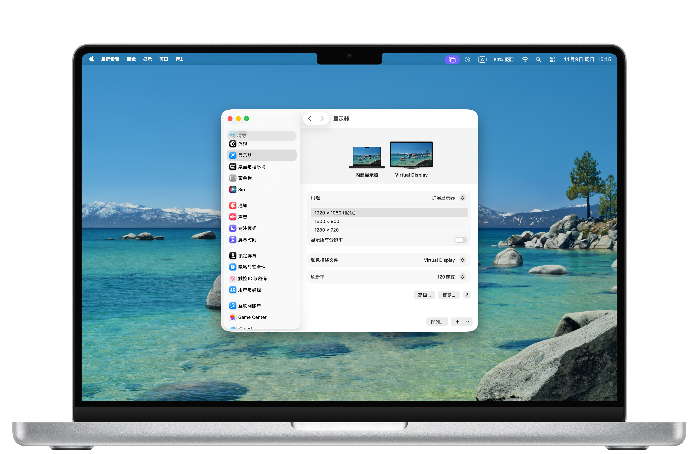

<div align="center">
  
  <h1>VoidDisplay</h1>
  <p>Create virtual displays, monitor screens, and share them over LAN — all from your Mac.</p>
  <a href="./docs/Readme_cn-zh.md">简体中文</a>
</div>

## ✨ Features

### 🖥️ Virtual Displays

Create virtual monitors with custom resolution and refresh rate.  
Perfect for headless Mac setups, display testing, or extending your workspace without a physical monitor.

### 👀 Screen Monitoring

Watch any connected display in its own dedicated floating window.  
Great for keeping an eye on a secondary screen without switching desktops.

### 📡 LAN Screen Sharing

Share any display over your local network through the built-in low-latency live page.  
Open the provided `/display` URL in a modern browser on any device on the same LAN. Playback uses WebSocket + H.264 + WebCodecs.

## 📸 Screenshots




## 💻 System Requirements

- macOS on Apple Silicon (M1 or later)

## 📥 Installation

### Download

Check the [Releases](../../releases) page for the latest build.

### Unsigned Build Notice (First Launch)

Current release builds are unsigned and not notarized yet, so macOS may block first launch with messages like:
- "cannot be opened because Apple cannot check it for malicious software"
- "is damaged and can't be opened"

If this happens:
1. Try Finder right-click on `VoidDisplay.app` -> **Open**.
2. If still blocked, run:

```bash
xattr -dr com.apple.quarantine "/Applications/VoidDisplay.app"
```

### Build from Source

1. Clone this repository.
2. Open `VoidDisplay.xcodeproj` in Xcode 26+.
3. Build and run (⌘R).

## 🚀 Getting Started

### Create a Virtual Display

1. Open VoidDisplay and go to the **Virtual Display** tab.
2. Click the **+** button to add a new virtual display.
3. Choose a preset or configure a custom resolution and refresh rate.
4. The virtual display appears immediately in your macOS display arrangement.

### Monitor a Screen

1. Go to the **Screen Monitoring** tab.
2. Select the display you want to monitor.
3. A floating window opens showing the live content of that display.

### Share a Screen over LAN

1. Go to the **Screen Sharing** tab.
2. Click **Share** next to the display you want to broadcast.
3. The app shows a local URL (e.g. `http://192.168.x.x:8080/display`).
4. Open that URL in a modern browser on the same network to watch the screen in real time.

Notes:
- `/display` and `/display/{id}` are the supported page routes.
- `/live` and `/live/{id}` are the underlying WebSocket transport routes.

## ❓ Troubleshooting

**No displays appear in Screen Monitoring or Screen Sharing?**

> macOS requires Screen Recording permission. Go to **System Settings → Privacy & Security → Screen Recording** and make sure VoidDisplay is enabled. If you changed the permission while the app was running, fully quit and reopen it.

**The shared screen page won't open from another device?**

> Make sure your Mac and the viewing device are on the same local network (Wi-Fi or Ethernet). The URL shown in the app must be reachable from the other device.

**The browser opens but playback does not start?**

> The live page now requires a modern browser with `WebSocket` and `WebCodecs` support. Use a current Chromium-based browser or a recent Safari/WebKit build on the viewing device.

**Virtual display failed to restore on app launch?**

> If a virtual display fails to restore, you'll see an alert in the Virtual Display tab. If the configuration file is corrupted, you can reset it by deleting:  
> `~/Library/Application Support/com.developerchen.voiddisplay/virtual-displays.json`

## 🛠️ For Developers

### Build & Test

Requirements: Xcode 26+, macOS Apple Silicon.

```bash
# Run unit tests (no paid developer certificate required)
xcodebuild -scheme VoidDisplay \
  -project VoidDisplay.xcodeproj \
  -configuration Debug test \
  -destination 'platform=macOS,arch=arm64'
```

Full project regression gate (recommended before opening/merging PR):

```bash
scripts/test/full_regression_gate.sh
```

This script runs end-to-end test/build gates and fails fast when:
- tests were not actually executed (`totalTestCount == 0`)
- any test failed
- Debug/Release build has warnings
- Debug/Release build failed

### Debug Entry Points

UI entry: `HomeView` contains four tabs — **Displays**, **Virtual Display**, **Screen Monitoring**, **Screen Sharing**.

Key files for debugging:

| Area | Files |
|------|-------|
| Virtual Display | `VirtualDisplayService.swift`, `CreateVirtualDisplayObjectView.swift`, `EditVirtualDisplayConfigView.swift` |
| Screen Capture | `CaptureChooseViewModel.swift`, `DisplayCaptureRegistry.swift`, `DisplayCaptureSession.swift`, `DisplayStartCoordinator.swift` |
| LAN Sharing | `ShareViewModel.swift`, `SharingService.swift`, `Features/Sharing/Web/WebServer.swift` |

Unified logs (`Logger`, subsystem `com.developerchen.voiddisplay`):

```bash
log stream --style compact --predicate 'subsystem == "com.developerchen.voiddisplay"'
```

## 📄 License

[Apache License 2.0](./LICENSE)

## 🤝 Project Lineage

VoidDisplay is a long-term maintained continuation of the original project by Phineas Guo:
[guoPhineas/FreelyDisplay](https://github.com/guoPhineas/FreelyDisplay).

The current repository is maintained at
[iamsyc/VoidDisplay](https://github.com/iamsyc/VoidDisplay), with upstream contribution history preserved in Git.

## 🙏 Acknowledgements

This project uses the private `CGVirtualDisplay` framework. See [LICENSE_CGVirtualDisplay](./LICENSE_CGVirtualDisplay) for details.
