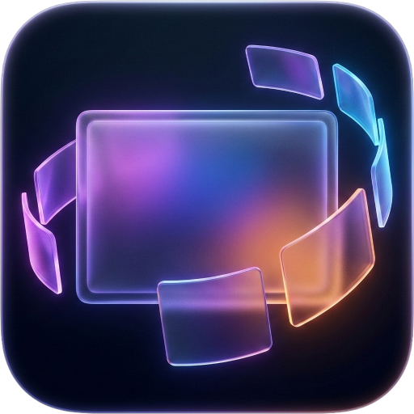
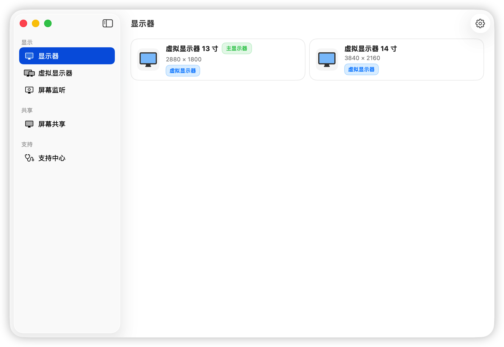
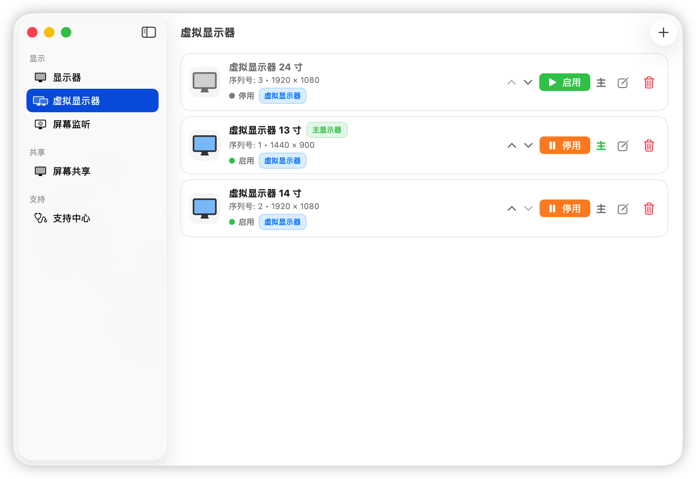
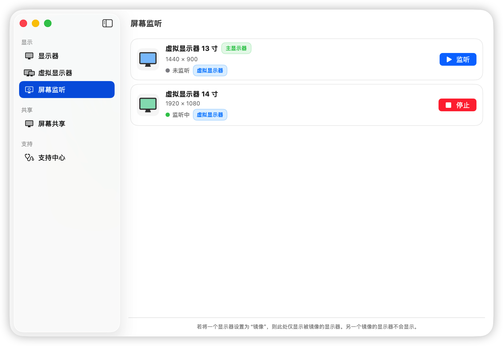
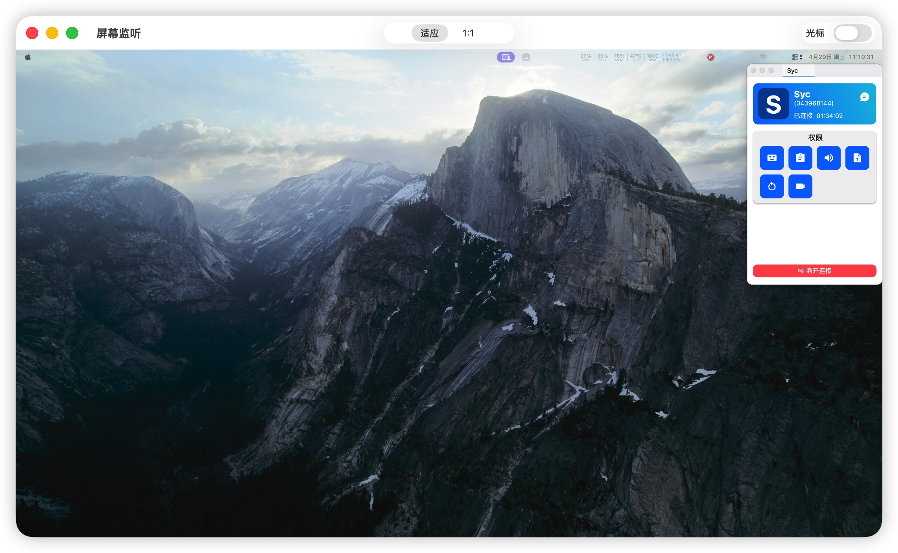
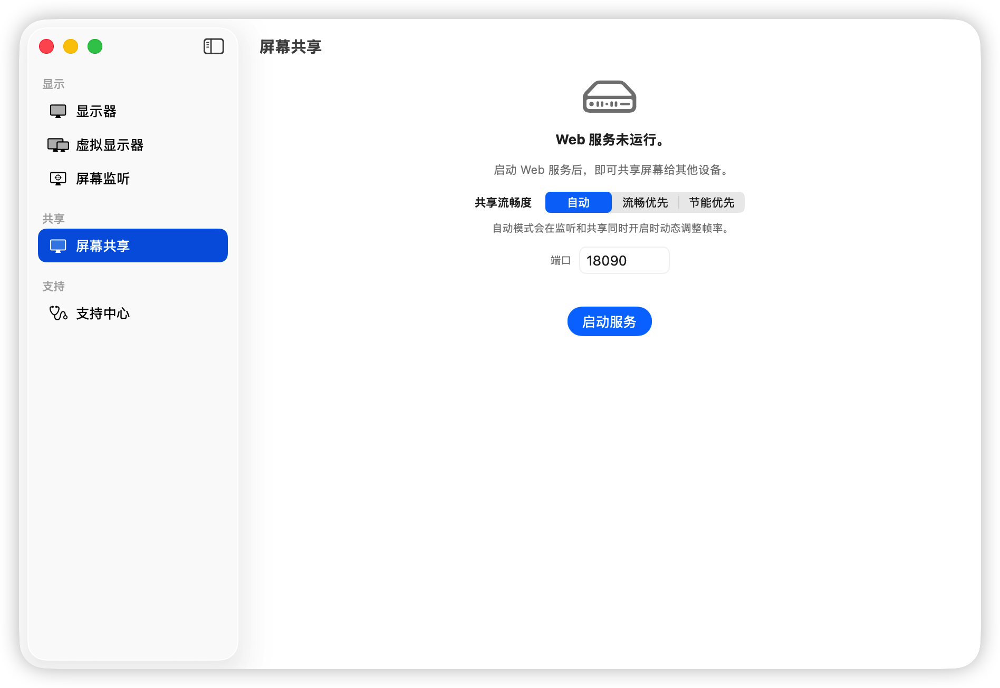
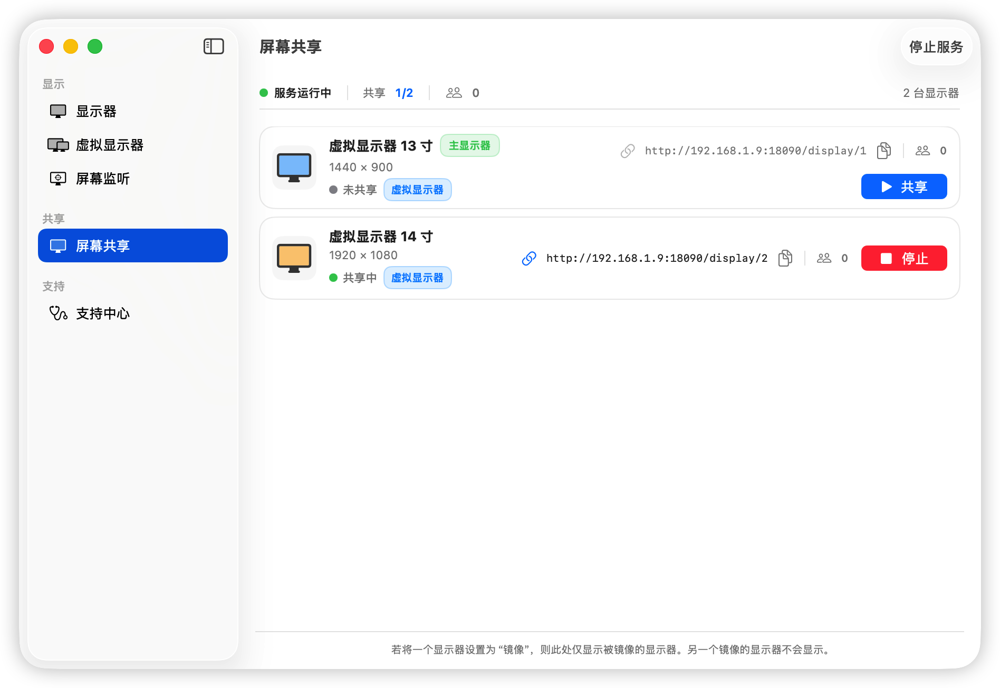
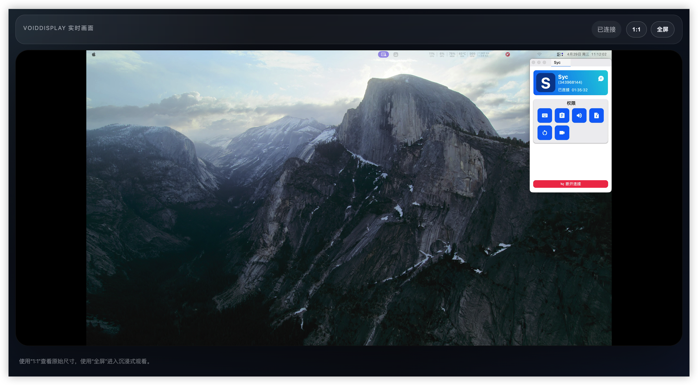

<div align="center">
  
  <h1>虚幕（VoidDisplay）</h1>
  <p>在 Mac 上创建虚拟显示器、监视屏幕、局域网共享屏幕。</p>
  <a href="../Readme.md">English</a>
</div>

## ✨ 功能特色

### 🖥️ 虚拟显示器

创建自定义分辨率和刷新率的虚拟显示器。  
适用于无头 Mac 部署、显示器测试，或者在没有物理显示器的情况下扩展你的工作空间。

### 👀 屏幕监听

在独立的浮动窗口中监听任意已连接的显示器。  
非常适合在不切换桌面的情况下关注副屏内容。

### 📡 局域网屏幕共享

通过内置低延迟实时页面将任意显示器共享到局域网。  
在同一网络的设备上，用现代浏览器打开 `/display` 链接即可观看。播放链路使用 WebRTC 媒体流，并通过 WebSocket 传输信令。

## 📸 界面截图

### 显示器总览

查看当前显示器、虚拟显示器以及对应分辨率。



### 虚拟显示器管理

在一个列表中创建、启用、停止、排序、编辑和删除虚拟显示器。



### 屏幕监听

按显示器启动或停止监听，并直接查看每个显示器的监听状态。



### 实时监听窗口

在独立窗口中查看显示器画面，支持适应窗口、1:1、全屏和光标控制。



### 屏幕共享服务

启动本机 Web 服务，选择共享流畅度，并配置端口。



### 共享链接

按显示器开启共享，并复制对应的局域网访问链接。



### 浏览器实时画面

在其他设备的浏览器中打开实时页面，观看共享的显示器画面。



## 💻 系统要求

- macOS 15.6 或更高版本
- Intel 或 Apple Silicon Mac

## 📥 安装

### 下载

前往 [Releases](https://github.com/iamsyc/VoidDisplay/releases) 页面获取最新版本。

### 无签名版本首次启动说明

当前 release 构建暂未签名和公证，macOS 首次启动时可能出现以下提示：
- “无法验证开发者”
- “已损坏，无法打开”

如果遇到拦截：
1. 先在 Finder 中右键 `VoidDisplay.app` -> **打开**。
2. 仍被拦截时，执行：

```bash
xattr -dr com.apple.quarantine "/Applications/VoidDisplay.app"
```

### 从源码构建

1. 克隆本仓库。
2. 用 Xcode 26+ 打开 `VoidDisplay.xcworkspace`。
3. 构建并运行（⌘R）。

## 🚀 快速上手

### 创建虚拟显示器

1. 打开 VoidDisplay，进入 **虚拟显示器** 标签页。
2. 点击 **+** 按钮添加新的虚拟显示器。
3. 选择预设方案，或输入自定义的分辨率和刷新率。
4. 虚拟显示器会立即出现在 macOS 的显示器排列中。

### 监视屏幕

1. 进入 **屏幕监听** 标签页。
2. 选择你想要监视的显示器。
3. 系统会打开一个浮动窗口，实时显示该显示器的内容。

### 局域网共享屏幕

1. 进入 **屏幕共享** 标签页。
2. 启动 Web 服务，并选择共享流畅度模式。
3. 点击想要共享的显示器旁边的 **共享** 按钮。
4. 复制生成的局域网地址，例如 `http://192.168.x.x:18090/display/1`。
5. 在同一网络的现代浏览器中打开该地址即可实时观看屏幕。

说明：
- 正式页面路由是 `/display` 和 `/display/{id}`。
- 底层 WebSocket 信令路由是 `/signal` 和 `/signal/{id}`。

## ❓ 常见问题

**屏幕监听或屏幕共享中没有可选的显示器？**

> macOS 需要授予"屏幕录制"权限。前往 **系统设置 → 隐私与安全性 → 屏幕录制**，确保 VoidDisplay 已启用。如果在应用运行期间更改了权限，请完全退出应用后重新打开。

**从其他设备打不开共享页面？**

> 请确保你的 Mac 和观看设备在同一个局域网（Wi-Fi 或有线网络）。应用中显示的 URL 必须从其他设备可以访问。

**页面能打开但不播放？**

> 实时页面要求浏览器支持 `WebSocket` 和 `RTCPeerConnection`。请在观看端使用较新的 Chromium 内核浏览器，或较新的 Safari/WebKit 版本。

**启动时虚拟显示器恢复失败？**

> 如果虚拟显示器恢复失败，虚拟显示器标签页会弹出提示。如果配置文件损坏，可以删除以下文件来重置：  
> `~/Library/Application Support/com.developerchen.voiddisplay/virtual-displays.json`

## 🛠️ 开发者

### 构建与测试

环境要求：Xcode 26+，macOS 15.6 或更高版本，Intel 或 Apple Silicon Mac。

```bash
# 运行 SwiftPM 单元测试（无需付费开发者证书）
swift test

# 构建 App
xcodebuild -scheme VoidDisplay \
  -workspace VoidDisplay.xcworkspace \
  -configuration Debug \
  -derivedDataPath .ai-tmp/readme-build/DerivedData \
  -destination 'generic/platform=macOS' \
  build
```

### 调试入口

UI 入口：`HomeView` 包含四个标签页：**显示器**、**虚拟显示器**、**屏幕监听**、**屏幕共享**。

常用调试文件：

| 功能区域 | 文件 |
|---------|------|
| 虚拟显示器 | `Sources/VoidDisplayVirtualDisplay/Services/VirtualDisplayOrchestrator.swift`、`Sources/VoidDisplayVirtualDisplay/Views/CreateVirtualDisplayObjectView.swift`、`Sources/VoidDisplayVirtualDisplay/Views/EditVirtualDisplayConfigView.swift` |
| 屏幕采集 | `Sources/VoidDisplayCapture/ViewModels/CaptureChooseViewModel.swift`、`Sources/VoidDisplayCapture/Services/DisplayCaptureRegistry.swift`、`Sources/VoidDisplayCapture/Services/DisplayCaptureSession.swift`、`Sources/VoidDisplayFoundation/RuntimeSupport/DisplayStartCoordinator.swift` |
| 局域网共享 | `Sources/VoidDisplaySharing/ViewModels/ShareViewModel.swift`、`Sources/VoidDisplaySharing/Services/SharingService.swift`、`Sources/VoidDisplaySharing/Web/WebServer.swift` |

统一日志（`Logger`，subsystem `com.developerchen.voiddisplay`）：

```bash
log stream --style compact --predicate 'subsystem == "com.developerchen.voiddisplay"'
```

## 📄 许可证

[Apache License 2.0](../LICENSE)

## 🤝 项目来源

本仓库基于 Phineas Guo 的原始项目长期维护而来：
[guoPhineas/FreelyDisplay](https://github.com/guoPhineas/FreelyDisplay)。

当前版本维护仓库为
[iamsyc/VoidDisplay](https://github.com/iamsyc/VoidDisplay)，功能演进、架构调整、测试体系和持续重构均在此持续进行，同时通过 Git 历史保留上游贡献记录。

## 🙏 致谢

本项目使用了私有的 `CGVirtualDisplay` 框架，详见 [LICENSE_CGVirtualDisplay](../LICENSE_CGVirtualDisplay)。
